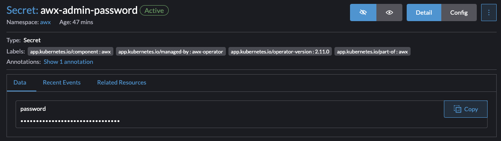

## **Installing AWX on a k3s Cluster**

This guide outlines the steps to install AWX, the open-source version of Ansible Tower, on a Kubernetes cluster managed by k3s. k3s is a lightweight Kubernetes distribution that simplifies the deployment and management of containerized applications. By installing AWX on k3s, you can leverage the power of Ansible for automation in a scalable and resilient Kubernetes environment.

### **Prerequisites**

Before you begin, ensure you have the following:

- A running k3s cluster.
- **`kubectl`** installed and configured to communicate with your k3s cluster.

## Copy the aws repo

```bash
git clone git@github.com:ansible/awx-operator.git
cd awx-operator
```

- Choose the tag to run

```bash
git checkout tags/2.11.0
```

- create the kustomize file

```bash
make deploy
```

- Deploy aws-operator

```bash
kubectl apply -k .
```

- wait until you have the awx-operator running

```bash
kubectl get pods -n awx
```

## Deploy your aws cluster

### Create your service

- Create the service

```bash
---
apiVersion: awx.ansible.com/v1beta1
kind: AWX
metadata:
  name: awx
spec:
  service_type: LoadBalancer
  loadbalancer_protocol: http
  loadbalancer_port: 80
```

- Create the ingressRoute

```bash
apiVersion: traefik.containo.us/v1alpha1
kind: IngressRoute
metadata:
  name: awx
  namespace: awx
  annotations: 
    kubernetes.io/ingress.class: traefik-external
spec:
  entryPoints:
    - websecure
  routes:
    - match: Host(`www.awx.lab.welpnetwork.com`)
      kind: Rule
      services:
        - name: awx-service
          port: 80
    - match: Host(`awx.lab.welpnetwork.com`)
      kind: Rule
      services:
        - name: awx-service
          port: 80
      middlewares:
        - name: default-headers
  tls:
    secretName: lab-welpnetwork-com-tls
```

- add the new file to the kustomize file

```bash
apiVersion: kustomize.config.k8s.io/v1beta1
kind: Kustomization
resources:
  # Find the latest tag here: https://github.com/ansible/awx-operator/releases
  - github.com/ansible/awx-operator/config/default?ref=2.11.0
  - awx.yml
  - ingress.yml
  - default-headers.yml

# Set the image tags to match the git version from above
images:
  - name: quay.io/ansible/awx-operator
    newTag: 2.11.0

# Specify a custom namespace in which to install AWX
namespace: awx
```

- apply the change

```bash
kubectl apply -k .
```

- You can now retrieve the password in Rancher
- Storage > Secrets > awx-admin-password

