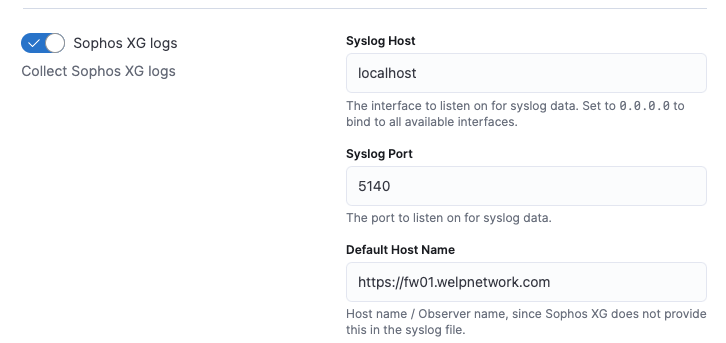
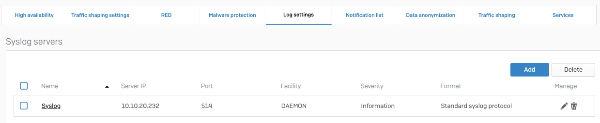
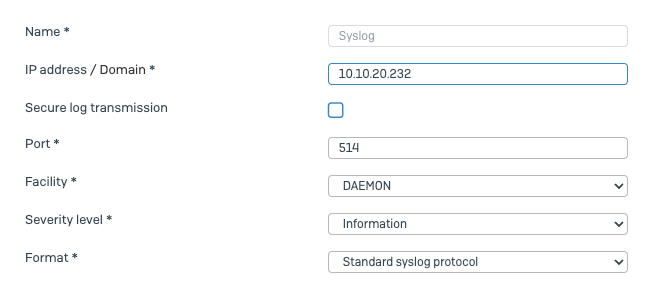
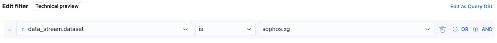

## Intro 

This tutorial will then walk you through the steps of installing and configuring rSyslog on an Ubuntu server to collect logs. With the addition of a Fleet agent on the syslog server with Sophos integration, you will be able to seamlessly forward Sophos logs for analysis. 

## Pre-requis

- You will need a Elastic/Kibana Server 
- You will need a Fleet server 
- A new server to install rSyslog
- rSyslog : server Ubuntu 22.04 > RAM : 2G // CPU : 1 // Disk : 16Go

## Syslog

### Installation of Rsyslog

- Install rsyslog

```bash
sudo apt-get update
sudo apt-get install rsyslog
```

- Configure rsyslog

```bash
sudo nano /etc/rsyslog.conf
```    

- Start & Enable rsyslog

```bash
sudo systemctl enable rsyslog
sudo systemctl start rsyslog
```

## Fleet Agent

Add a fleet agent on the syslog server with sophos integration 



## Sophos syslog

Make sophos send log to your syslog server

System services > Log settings 





Save > Apply

## Kibana

Go to kibana 

Analytics > Discover 

Add a filter data_stream.dataset:sophosxg

